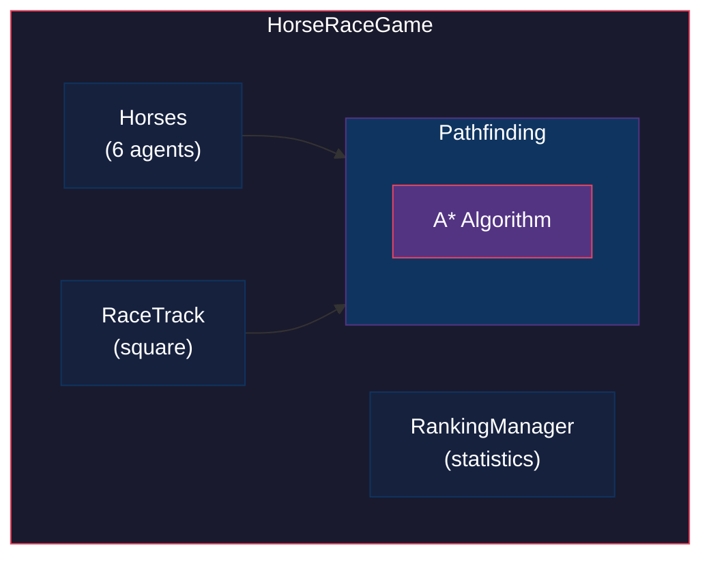

# 🏇 Horse Race Derby - A* Pathfinding & Flocking Simulation

A pygame-based horse racing simulation featuring autonomous AI horses that use A* pathfinding and Boids flocking algorithms to navigate a race track. This project demonstrates practical applications of pathfinding and emergent behavior in game development.

## ⚠️ Development Attribution & AI Disclaimer

- **Code Generation:** The core game logic, pathfinding algorithms, and agent behaviors were generated with assistance from DeepSeek.
- **Documentation:** This README, architectural diagrams, and technical explanations were written by Lumo (Proton's AI assistant).

*This project serves as an educational example of human-AI collaborative software development.*

---

## 📖 Overview

This horse racing game simulates 6 autonomous horses competing on a square track. Each horse uses:

- **A* Pathfinding** to find optimal routes between checkpoints
- **Flocking Behavior** to avoid collisions and coordinate with other horses
- **Learning Memory** to remember barriers and improve future races

The race ends when all horses complete 1 lap, with statistics tracked for performance analysis.

---

## ✨ Game Features

| Feature | Description |
|---------|-------------|
| **6 AI Horses** | Autonomous agents with unique colors and names |
| **Square Track** | 4-sided race track with 9 checkpoints |
| **Pathfinding** | A* algorithm finds optimal routes around barriers |
| **Flocking** | Separation, alignment, and cohesion behaviors |
| **Statistics** | Lap times, resets, distance traveled, rankings |
| **Persistence** | Race results saved to `horse_rankings.json` |

---

## 🏗️ Technical Architecture



---

## 🧭 A* Pathfinding Implementation

### Purpose
Each horse uses A* to find the shortest path from its current position to the next checkpoint while avoiding track barriers.

### Key Components

#### Grid System (`models/grid.py`)
- Converts world coordinates to grid cells (`node_size = 10 pixels`)
- Marks track cells as `RACE_TRACK` (walkable)
- Creates barriers around track edges as `UNWALKABLE`
- 8-directional neighbor checking for diagonal movement

#### Pathfinding Logic (`pathfinding/astar.py`)
```python
# Cost Calculation
F = G + H
- G: Actual distance traveled from start
- H: Heuristic estimate to target (direct/Euclidean distance)
- F: Total estimated cost

# Heuristic
Uses direct Euclidean distance for most direct routing:
distance = sqrt(dx² + dy²) * 10
```

#### Path Optimization
- **Caching:** Reuses successful paths between checkpoint pairs
- **Barrier Memory:** Horses remember barrier positions to avoid repeats
- **Line of Sight:** Simplifies paths by removing redundant waypoints
- **Avoidance:** Can exclude known barrier positions from search

#### Integration with Horses
```python
# In models/horse.py - request_new_path()
result = pathfinder.find_path(start, end, avoid_positions=self.barrier_memory)
if result.success:
    self.current_path = result.path
```

---

## 🐑 Flocking Algorithm

### Overview
Based on Craig Reynolds' Boids algorithm, each horse exhibits three core behaviors plus game-specific forces.

### Core Behaviors

| Behavior | Weight | Purpose |
|----------|--------|---------|
| **Separation** | 1.0 | Avoid crowding nearby horses |
| **Alignment** | 1.2 | Match velocity with neighbors |
| **Cohesion** | 1.0 | Move toward group center |

### Game-Specific Forces

| Force | Weight | Purpose |
|-------|--------|---------|
| **Path Following** | 3.0 | Follow A*-generated path to checkpoint |
| **Track Attraction** | 3.0 | Stay on the race track |
| **Barrier Avoidance** | 5.0 | Steer away from track barriers |
| **Checkpoint Attraction** | 5.0 | Move toward current checkpoint |
| **Clockwise Enforcement** | 4.0 | Prevent counter-clockwise shortcuts |

### Force Application
```python
# In models/horse.py - flock()
steering_force = separation + alignment + cohesion + path + track + barriers + checkpoint + clockwise
acceleration += steering_force
velocity += acceleration
position += velocity
```

### Stuck Detection & Recovery
- **Stuck Timer:** Resets if horse moves < 1 pixel per frame for 250 frames
- **Barrier Hit Counter:** Resets after 8 consecutive barrier hits
- **Wrong Direction Penalty:** Resets if moving counter-clockwise too often
- **Auto-Reset:** Returns horse to start when stuck conditions detected

---

### Dependencies
- Python 3.7+
- Pygame 2.0+

---

## 🎮 Controls

| Input | Action |
|-------|--------|
| **Mouse Click** | Select a horse (shows info panel) |
| **R Key** | Reset race (manual) |
| **Reset Button** | Reset race (UI) |
| **Q Key** | Quit after race completes |

---

## 📁 File Structure

```
project/
├── main.py                     # Entry point
├── config.py                   # Game settings (FPS, dimensions, horse names)
├── README.md                   # This file
├── horse_rankings.json         # Saved race results
│
├── game/
│   └── horse_race_game.py      # Main game loop and UI
│
├── models/
│   ├── horse.py                # Horse agent with flocking logic
│   ├── grid.py                 # Grid system for pathfinding
│   ├── node.py                 # Node class for A*
│   ├── vector2.py              # 2D vector math
│   └── ranking.py              # Statistics and persistence
│
├── pathfinding/
│   └── astar.py                # A* pathfinding implementation
│
├── track/
│   └── race_track.py           # Track generation and checkpoint system
│
└── utils/
    └── colors.py               # Color palette
```
---

## 📄 License

This project is for educational purposes. Feel free to modify and extend for learning pathfinding and flocking algorithms.

---

## 🙏 Credits

- **AI Code Generation:** DeepSeek
- **Documentation & Architecture:** Lumo (Proton AI)
- **A* Algorithm:** Based on Unity pathfinding tutorial logic
- **Flocking:** Craig Reynolds' Boids algorithm
- **Graphics:** Pygame rendering library

---
*Built with ❤️ for learning game AI and pathfinding algorithms through human-AI collaboration*
